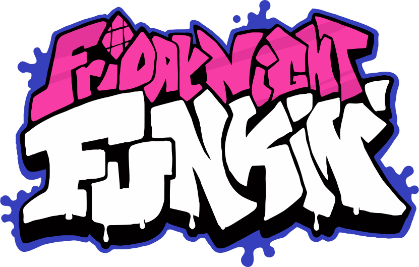

# Awesome Friday Night Funkin' Resources 

  

> A maintained, community-curated list of Friday Night Funkin' resources for modding, engines, art, music, charting, tools, and documentation.

This is an independent community-maintained resource list.  
It is not affiliated with or endorsed by The Funkin' Crew.

The goal is to collect useful, updated, recommended, and amazing resources for the Friday Night Funkin' community.

## Contents

- [Official Links](#official-links)
- [Getting Started](#getting-started)
- [Modding](#modding)
- [Engines and Forks](#engines-and-forks)
- [Programming](#programming)
- [Art and Animation](#art-and-animation)
- [Spritesheets and Texture Atlases](#spritesheets-and-texture-atlases)
- [Music and Chromatics](#music-and-chromatics)
- [Charting](#charting)
- [Tools](#tools)
- [Community Sites](#community-sites)
- [Archived and Outdated Resources](#archived-and-outdated-resources)
- [Contributing](#contributing)

## Official Links

- [Friday Night Funkin' on Newgrounds](https://www.newgrounds.com/portal/view/770371) - Official Newgrounds page for Friday Night Funkin'.
- [Funkin' Website](https://funkin.me/) - Official website for Friday Night Funkin' news and updates.
- [Funkin' Blog](https://funkin.me/blog/) - Official development posts and announcements.
- [Funkin' Source Code](https://github.com/FunkinCrew/Funkin) - Official source code repository for Friday Night Funkin'.
- [Funkin' Art Files](https://github.com/FunkinCrew/funkin.art) - Official repository for Friday Night Funkin's Art files.
- [Friday Night Funkin' Cookbook](https://thekade.net/funkin-cookbook/) - Official Funkin' modding cookbook with tutorials, guides, examples, and resources for beginner through expert mod creators.

## Getting Started

Resources for people who are new to Friday Night Funkin' modding.

- [LongestSoloEver's Modding Tutorials](https://www.youtube.com/playlist?list=PLfb6KneL63QuD0T0lolMvkQPQM7ZPjy9n) - Beginner-friendly video playlist that covers the full FNF mod creation workflow.
- [FNF Music Tutorial Playlist - LongestSoloEver](https://www.youtube.com/playlist?list=PLfb6KneL63QsQ58tj-RkDCHRmheAofPJj) - Beginner-oriented guides for writing and arranging FNF music.
- [Phantom Arcade Teaching Animation](https://youtu.be/bLqTpYNZ1C4) - Animation teaching stream from a Funkin' Crew lead artist.

## Modding

General resources for creating, installing, organizing, and publishing mods.

- [Psych Engine Mod Installing Tutorial](https://youtu.be/S-vC_kaWLPo) - Walkthrough for installing Psych Engine mod packages in the `mods/` folder.
- [Catbrother Everything's Psych Engine Modding Series](https://youtube.com/playlist?list=PL60i09WIEpP2W3SS0ObJFWcFOyxk-xMRx) - Practical Psych Engine tutorial series that covers common modding tasks.

## Engines and Forks

Engines, forks, and builds used for playing or creating Friday Night Funkin' mods.

- [Psych Engine](https://github.com/ShadowMario/FNF-PsychEngine) - Popular FNF engine with Lua scripting, mod support, and many quality-of-life features.
- [Codename Engine](https://codename-engine.com/) - FNF engine focused on softcoding and HScript-based modding.
- [FPS Plus](https://github.com/ThatRozebudDude/FPS-Plus-Public) - FNF fork with input improvements, higher framerate support, and gameplay changes.
- [ALE Psych](https://github.com/ALE-Psych-Crew/ALE-Psych) - FNF engine inspired by Psych Engine that focuses on softcoding, customization, scripting, and freedom.
- [Nightmare Vision Engine](https://github.com/NMVTeam/NightmareVision) - Psych-based FNF engine with modchart support, camera rotation support, and HaxeFlixel source compilation setup.
- [Crow Engine](https://github.com/EyeDaleHim/Crow-Engine) - Base-game-focused engine fork with performance improvements and codebase cleanup.
- [Super Engine](https://github.com/superpowers04/Super-Engine) - Kade-based engine fork with mod support and expanded features.

### Ports and Rewrites

- [FNF LÖVE](https://github.com/Stilic/FNF-LOVE) - LÖVE2D recreation of FNF with cross-platform build targets.
- [Funkin' Android](https://github.com/luckydog7/Funkin-android) - Android-focused FNF fork with touch controls and mobile optimizations.
- [Vanilla Engine](https://github.com/VanillaEngineDevs/Vanilla-Engine) - Modding-focused fork of Funkin' Rewritten with added quality-of-life features.
- [Funkin3D](https://github.com/GuglioIsStupid/Funkin3D) - Nintendo 3DS de-make built with LÖVEPOTION.

## Programming

Resources for coding, scripting, compiling, or understanding how FNF works internally.

### Haxe and HaxeFlixel

- [Haxe Manual](https://haxe.org/manual/introduction.html) - Official documentation for the Haxe programming language.
- [HaxeFlixel Documentation](https://haxeflixel.com/documentation/) - Official documentation for the HaxeFlixel game framework.
- [HaxeFlixel Cheat Sheet](https://haxeflixel.com/documentation/cheat-sheet/) - Quick examples for common HaxeFlixel features.
- [HaxeFlixel Demos](https://haxeflixel.com/demos/) - Example projects that demonstrate core HaxeFlixel systems.
- [HaxeFlixel Game Development Tools](https://haxeflixel.com/documentation/game-development-tools/) - Recommended tools and setup references from HaxeFlixel.
- [HaxeFlixel Snippets](https://snippets.haxeflixel.com/) - Searchable HaxeFlixel code snippets with runnable demos.
- [HaxeFlixel Tutorial Game (TurnBasedRPG)](https://haxeflixel.com/documentation/tutorial/) - Step-by-step tutorial project for learning HaxeFlixel fundamentals.
- [Online HaxeFlixel Crash Course](https://youtube.com/playlist?list=PLiKs97d-BatFGPrkf7yNN0e6IyToRaaYO) - Video-based introduction to building games with HaxeFlixel.

### Editors and Extensions

- [Visual Studio Code](https://code.visualstudio.com/) - Common code editor used for Haxe, HaxeFlixel, and FNF development.
- [Funkin Compiler](https://thekade.net/funkin-cookbook/community/funkin-compiler-vscode-extension/) - VS Code extension for FNF Base Game mod development with Haxe autocomplete, static checking, JSON hints, and mod project tooling.
- [Enable VSCode Debug Tools](https://twitter.com/EliteMasterEric/status/1535814918917734400) - Setup tips for enabling practical debug tooling in VS Code.
- [Funkin' Script AutoComplete](https://github.com/Snirozu/Funkin-Script-AutoComplete) - VS Code extension that adds Psych Engine Lua autocomplete.
- [FNF Source Code Bat File](https://gamebanana.com/tools/21856) - Batch-file helper for common FNF source code workflow steps.

### Scripting

- [Example Lua Script for Atlas Spritesheets](https://github.com/MarkimusZer0/SmokeyTextureAtlas-Example/blob/main/ExampleScript/spawnAtlasPico.lua) - Example script showing how to spawn and use atlas sprites in Psych Engine.

## Art and Animation

Resources for character art, backgrounds, sprites, animation, and visual design.

### Art Software

- [Krita](https://krita.org/en/) - Free and open-source drawing and painting software.
- [Aseprite](https://www.aseprite.org/) - Pixel art and animation editor.

### Animation Software

- [OpenToonz](https://opentoonz.github.io/e/) - Free and open-source 2D animation software.
- [Wick Editor](https://www.wickeditor.com/) - Browser-based tool for animation and simple interactive projects.
- [Synfig Studio](https://www.synfig.org/) - Free and open-source 2D animation software with vector tweening and rigging tools.
- [Glaxnimate](https://glaxnimate.mattbas.org/) - Free and open-source vector animation editor focused on lightweight workflows.

### Guides

- [The ULTIMATE Guide to ADOBE ANIMATE CC! (AKA Flash) - Tutorial](https://youtu.be/3iXSQ8VcPcU) - Long-form Adobe Animate tutorial with chapter timestamps.
- [How to make 3D Friday Night Funkin Sprites (USING BLENDER)](https://youtu.be/fAuD_54Euq0) - Guide for building FNF-style 3D sprites in Blender.
- [Week 7 Update FLAs](https://twitter.com/PhantomArcade3K/status/1521540912421257218) - Official Week 7 Flash source files shared by PhantomArcade.
- [FNF Logo SVG recreation](https://commons.wikimedia.org/wiki/File:FNF-Logo.svg) - Editable vector version of the FNF logo for clean redesign and recolor work.

## Spritesheets and Texture Atlases

Tools and guides for creating spritesheets, XML files, and texture atlases.

- [FNF Spritesheet and XML Maker](https://github.com/UncertainProd/FnF-Spritesheet-and-XML-Maker) - Tool for creating FNF-style spritesheets and XML files.
- [Free Texture Packer](http://free-tex-packer.com/) - Tool for packing frames into spritesheets.
- [Free Online Spritesheet Maker](https://www.leshylabs.com/apps/sstool/) - Web tool for building spritesheets and XML metadata files.
- [Aseprite JSON to XML](https://github.com/MaybeMaru/Aseprite-JSON-to-XML) - Converter from Aseprite JSON exports to Sparrow XML format.
- [Sparrow Atlas Resizer](https://github.com/KadeDev/SparrowAtlasResizer) - Utility for resizing Sparrow atlas PNG and XML pairs.
- [TextureAtlas Toolbox](https://gamebanana.com/tools/16621) - Toolbox for working with FNF texture atlas assets.
- [FNF Scratch XML Sprite Loader](https://gamebanana.com/tools/22091) - Loader utility for Scratch-style XML sprite workflows.
- [FNF Spritesheet Optimizer HTML (PC/ANDROID)](https://gamebanana.com/tools/21860) - Browser-based spritesheet optimizer for PC and Android.
- [oxipng](https://github.com/shssoichiro/oxipng) - PNG optimizer that can help reduce asset file sizes.
- [compresspng](https://compresspng.com/) - Browser-based PNG compression tool for quick file size reductions.
- [Funker Optimizer](https://gamebanana.com/tools/19963) - Optimizer tool for reducing and cleaning up FNF assets.
- [Atlas Export Tutorial Video (PSYCH ENGINE IMPLEMENTATION)](https://twitter.com/MarkimusZer0/status/1681690825518903296?s=20) - Video walkthrough for exporting texture atlases for Psych Engine workflows.
- [Atlas Character Tutorial (PSYCH ENGINE)](https://twitter.com/MarkimusZer0/status/1681691342349426689?s=20) - Follow-up tutorial for integrating texture atlases into Psych Engine characters.

## Music and Chromatics

Resources for making songs, vocals, chromatic scales, soundfonts, and mixes.

### Music Software

- [LMMS](https://lmms.io/) - Free and open-source music production software.
- [Waveform Free](https://www.tracktion.com/products/waveform-free) - Free digital audio workstation for music production.
- [SoundBridge](https://soundbridge.io/) - Free DAW with an accessible workflow for newer producers.
- [Cakewalk by BandLab](https://www.bandlab.com/products/cakewalk) - Full-featured DAW available at no cost for Windows users.
- [Caustic 3](https://singlecellsoftware.com/caustic) - Lightweight rack-style music tool with desktop and mobile support.

### Chromatic Scales

- [Polyphone](https://www.polyphone-soundfonts.com/) - SoundFont editor useful for working with samples and instruments.
- [How to MAKE CHROMATICS (Friday Night Funkin) - bbpanzu](https://youtu.be/a7SGu1fNthc) - Introductory guide for building chromatic scales from samples.
- [EASY FNF chromatic guide! (Friday Night Funkin') - StickyBM](https://youtu.be/PlSh_LJwQD0) - Beginner chromatic workflow tutorial with practical examples.
- [How to make FNF Chromatics in Ableton - LongestSoloEver](https://www.youtube.com/watch?v=QCA6-N-pW_0) - Ableton-focused process for preparing usable chromatic scales.
- [MELODYNE FNF CHROMATIC SCALE TUTORIAL - Emihead](https://youtu.be/MSAmOhJVRLw) - Melodyne workflow guide for clean pitch and sample handling.
- [Chromatic Scale Generator](https://gamebanana.com/tools/8906) - Tool that converts sample inputs into full chromatic note sets.

### Composition and Mixing

- [Stems & Chromatic Scales](https://drive.google.com/drive/folders/1XndrqjB48K3HTj0V3l0HSUGtCttRfiH9) - Officially released FNF stems and chromatic references by Kawai Sprite.
- [How to Mimic Boyfriend's Voice](https://youtu.be/YOrC9uQiK00) - Quick tutorial for creating Boyfriend-style vocal processing.
- [Writing Vocal Duets - LongestSoloEver](https://youtu.be/nDPpO4fLiAM) - Guide for arranging duets and call-and-response melodies in FNF songs.
- [6 Reasons your FNF Music Sucks - LongestSoloEver](https://youtu.be/kela6mWtIlU) - Breakdown of common songwriting mistakes in FNF-style tracks.
- [Saruky's Google Doc](https://docs.google.com/document/d/1wva21t4HHb8nIK71KqAXQxHTl9IXU-dEH8g249SdHWo/edit) - Community-maintained list of plugins, VSTs, and production references.

## Charting

Tools and guides for creating, editing, converting, and testing charts.

- [ArrowVortex](https://arrowvortex.ddrnl.com/) - Chart editor for rhythm games.
- [Moonchart](https://github.com/MaybeMaru/moonchart) - Tool/library for converting and managing rhythm game charts.
- [fnf-to-sm](https://github.com/Ashen-Haze/fnf-to-sm) - Converter for translating between FNF JSON charts and StepMania simfiles.
- [SM-to-FNF-Dance-Double](https://github.com/tzheng22/SM-to-FNF-Dance-Double) - Converter for StepMania charts with BPM change support for FNF workflows.
- [SNIFF - SiIva Note Importer for FNF](https://github.com/PrincessMtH/SNIFF) - Utility for converting FL Studio note data into FNF-compatible chart files.
- [Modchart Editor](https://gamebanana.com/tools/10566) - Visual editor for creating and testing Psych Engine modcharts.
- [FNF Json Chart files to Midi Converter](https://gamebanana.com/tools/22420) - Converts FNF JSON chart files into MIDI files.
- [Codename Engine Chat to Midi Converter](https://gamebanana.com/tools/22234) - Converts Codename Engine chart data into MIDI files.
- [OSU Mania to Funkin Tool](https://gamebanana.com/tools/21925) - Converter for bringing osu!mania charts into Funkin' format.
- [FNF Yoshi Engine to Psych Chart Converter](https://gamebanana.com/tools/21654) - Converts Yoshi Engine charts for Psych Engine use.
- [MidiSing - MIDI To FNF Chart tool](https://gamebanana.com/tools/20817) - Converts MIDI files into FNF chart data.
- [FNF Chart Generator](https://gamebanana.com/tools/21018) - Generates FNF chart files from prepared inputs.
- [FNF Chart Generator Portable](https://gamebanana.com/tools/21707) - Portable version of an FNF chart generation tool.

## Tools

Useful tools for managing files, testing mods, converting assets, or improving workflow.

### Asset Tools

- [Psych Engine to V-Slice Stage Converter](https://gamebanana.com/tools/22496) - Converts Psych Engine stage data for V-Slice projects.
- [V-Slice Stage Editor Refreshed](https://gamebanana.com/tools/20697) - Stage editor utility for V-Slice workflows.
- [Psych to Codename Character Converter](https://gamebanana.com/tools/22380) - Converts Psych Engine character data to Codename format.
- [Psych To V-Slice Character Converter](https://gamebanana.com/tools/21889) - Converts Psych Engine character files to V-Slice format.
- [FNF V-Slice to Psych Character Converter](https://gamebanana.com/tools/21640) - Converts V-Slice character files to Psych Engine format.
- [V-Slice Character Editor V4](https://gamebanana.com/tools/20356) - Character editor for creating or updating V-Slice character data.

### Mod Management

- [funkhub a FNF Mod Launcher and Manager](https://gamebanana.com/tools/22153) - Launcher and manager for organizing and running FNF mods.

### Debugging and Testing

## Community Sites

Places to find mods, discussion, documentation, credits, and community resources.

- [GameBanana](https://gamebanana.com/games/8694) - Main mod hosting site for Friday Night Funkin'.
- [GameJolt FNF Community](https://gamejolt.com/c/fnf) - Community page for FNF-related projects and mods.
- [Funkipedia Mods Wiki](https://fridaynightfunking.fandom.com/wiki/Funkipedia_Mods_Wiki) - Community wiki for FNF mods and characters.
- [The /funkg/pedia Wiki](https://funkinchan.club/wiki/Main_Page) - Community-run wiki covering many FNF mods and projects.

## Archived and Outdated Resources

Older resources that may still be useful for reference, but should not be treated as current.

- [ARCHIVED](./ARCHIVED.md) - Legacy links to deprecated or out-of-date resources from previous versions of this list.

## Contributing

Contributions are welcome.

Before adding a resource, make sure it is useful, relevant, and worth recommending. This list should stay curated.

Good resources should:

- Be related to Friday Night Funkin' or FNF modding.
- Have a working link.
- Include a clear description.
- Be useful to modders, artists, musicians, charters, developers, or players.
- Credit the original creator when possible.

Please read the [contribution guidelines](CONTRIBUTING.md) before opening a pull request.
